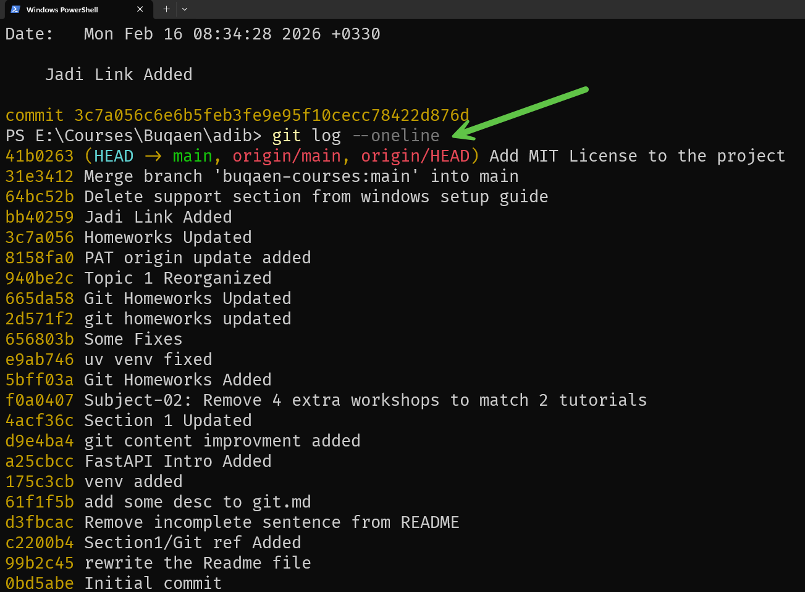

# Git Log Output

The image above shows the output of the `git log --oneline` command, which displays a condensed view of the commit history. Each line represents a single commit, showing:

- **Commit hash** (abbreviated SHA-1)
- **Commit message**

This is useful for quickly reviewing the project's commit history without detailed information like author, date, or full commit messages.

